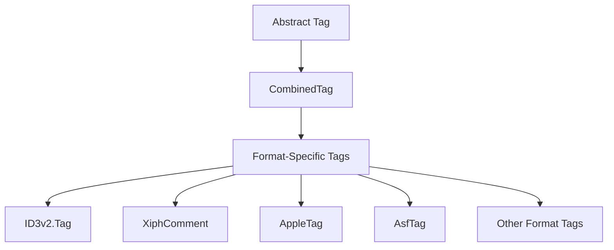

# TagLib# Architecture Overview 📐

## Table of Contents
- [System Overview](#system-overview)
- [Core Architecture](#core-architecture)
- [Format Support Matrix](#format-support-matrix)
- [Data Flow](#data-flow)
- [Component Breakdown](#component-breakdown)
- [Extension Points](#extension-points)
- [Dependencies](#dependencies)
- [Design Patterns](#design-patterns)

## System Overview

TagLib# is a cross-platform .NET library for reading and writing metadata in various media file formats. The architecture follows a layered approach with clear separation between format-specific implementations and common abstractions.

```
┌─────────────────────────────────────────────────────────────┐
│                    Public API Layer                        │
├─────────────────────────────────────────────────────────────┤
│                  Core Abstraction Layer                    │
├─────────────────────────────────────────────────────────────┤
│              Format-Specific Implementations               │
├─────────────────────────────────────────────────────────────┤
│                 File System Abstraction                    │
└─────────────────────────────────────────────────────────────┘
```

### Key Design Principles

1. **Format Agnostic**: Public API hides format-specific details
2. **Extensible**: Easy to add new format support
3. **Type Safe**: Strong typing with minimal boxing/unboxing
4. **Memory Efficient**: Lazy loading and efficient byte operations
5. **Cross-Platform**: Works on all .NET supported platforms

## Core Architecture

### Primary Namespaces

```
TagLib/
├── Core abstractions (File, Tag, Properties)
├── Collections/ - Collection types and utilities
├── Id3v1/ - ID3v1 tag format support
├── Id3v2/ - ID3v2 tag format support
├── Mpeg/ - MPEG audio file support
├── Mpeg4/ - MPEG-4 container format
├── Ogg/ - Ogg container and Xiph comments
├── Riff/ - RIFF container (AVI, WAV)
├── Flac/ - FLAC audio format
├── Asf/ - Advanced Systems Format (WMA/WMV)
├── Matroska/ - Matroska/WebM container
├── Image/ - Image file format support
├── Tiff/ - TIFF and camera RAW formats
├── Jpeg/ - JPEG image format
├── Png/ - PNG image format
├── Gif/ - GIF image format
├── IFD/ - Image File Directory (EXIF/TIFF)
├── Xmp/ - XMP metadata standard
├── Ape/ - APE tag format
├── Mpc/ - Musepack audio format
├── WavPack/ - WavPack audio format
└── NonContainer/ - Non-container file formats
```

## Format Support Matrix

### Audio Formats

| Format | Container | Tags | Properties | Codec Info |
|--------|-----------|------|------------|------------|
| MP3 | MPEG | ID3v1, ID3v2, APE | ✅ | MPEG Audio |
| FLAC | Native | Xiph Comments | ✅ | FLAC |
| OGG | Ogg | Xiph Comments | ✅ | Vorbis, Opus |
| MP4/M4A | MPEG-4 | iTunes/Apple | ✅ | AAC, ALAC |
| WMA | ASF | ASF Tags | ✅ | WMA |
| APE | Native | APE Tags | ✅ | Monkey's Audio |
| MPC | Native | APE Tags | ✅ | Musepack |
| WV | WavPack | APE Tags | ✅ | WavPack |
| WAV | RIFF | INFO, ID3 | ✅ | PCM |
| AIFF | Native | ID3 | ✅ | PCM |

### Video Formats

| Format | Container | Tags | Properties | Codec Info |
|--------|-----------|------|------------|------------|
| MP4/M4V | MPEG-4 | iTunes/Apple | ✅ | H.264, H.265 |
| AVI | RIFF | INFO | ✅ | Various |
| MKV | Matroska | Matroska Tags | ✅ | Various |
| ASF/WMV | ASF | ASF Tags | ✅ | WMV |

### Image Formats

| Format | Tags | Properties | Metadata |
|--------|------|------------|----------|
| JPEG | EXIF, XMP, IPTC | ✅ | Full support |
| TIFF | EXIF, XMP, IPTC | ✅ | Full support |
| PNG | XMP, text chunks | ✅ | Limited |
| GIF | XMP | ✅ | Limited |
| RAW (CR2, NEF, ARW, etc.) | EXIF, XMP | ✅ | Camera specific |

## Data Flow

### File Reading Process

```mermaid
graph TD
    A[File.Create()] --> B[Format Detection]
    B --> C[File Type Resolver]
    C --> D[Format-Specific Parser]
    D --> E[Metadata Extraction]
    E --> F[Tag Abstraction]
    F --> G[Public API]

    B --> H[MIME Type Detection]
    H --> I[FileTypes Registry]
    I --> D
```

### Tag Reading Hierarchy



## Component Breakdown

### 1. Core Abstractions

#### File (Abstract Base Class)
- **Location**: `src/TaglibSharp/File.cs`
- **Purpose**: Base class for all file formats
- **Key Methods**:
  - `Create()` - Factory method with format detection
  - `GetTag()` - Retrieve format-specific tags
  - `Save()` - Write changes back to file
  - File I/O operations (Read/Write/Seek)

#### Tag (Abstract Base Class)
- **Purpose**: Common interface for all metadata formats
- **Properties**: Title, Artist, Album, Year, Genre, Pictures, etc.
- **Implementations**: Combined tag that aggregates multiple format tags

#### Properties (Abstract Base Class)
- **Purpose**: Media properties (duration, bitrate, dimensions)
- **Implementations**: Format-specific property classes

### 2. File Format Implementations

#### Audio File Formats

**MPEG Audio (`Mpeg/AudioFile.cs`)**
- Supports MP3 files with ID3v1, ID3v2, and APE tags
- Header parsing for audio properties
- Frame-level access for advanced scenarios

**FLAC (`Flac/File.cs`)**
- Native FLAC metadata blocks
- Xiph comment support
- Integrated picture support

**Ogg (`Ogg/File.cs`)**
- Page-based container format
- Supports Vorbis, Opus, FLAC-in-Ogg
- Xiph comment metadata

**MPEG-4 (`Mpeg4/File.cs`)**
- Atom/box-based structure
- iTunes-compatible metadata
- Support for audio and video

#### Image File Formats

**JPEG (`Jpeg/File.cs`)**
- EXIF, XMP, IPTC metadata support
- Segment-based parsing
- JFIF and EXIF headers

**TIFF (`Tiff/File.cs`)**
- IFD (Image File Directory) structure
- Comprehensive EXIF support
- Camera RAW format support

### 3. Metadata Standards

#### EXIF/TIFF (`IFD/` namespace)
- **Structure**: Image File Directory entries
- **Types**: Various data types (string, rational, byte arrays)
- **Tags**: Comprehensive camera and image metadata
- **Extensions**: Maker-specific extensions (Canon, Nikon, etc.)

#### XMP (`Xmp/` namespace)
- **Standard**: Adobe's Extensible Metadata Platform
- **Format**: RDF/XML-based
- **Features**: Hierarchical metadata, multiple values
- **Integration**: Embedded in JPEG, TIFF, PNG

#### ID3 (`Id3v1/`, `Id3v2/` namespaces)
- **v1**: Fixed-length fields, limited character set
- **v2**: Variable-length frames, Unicode support
- **Versions**: 2.2, 2.3, 2.4 with different features

### 4. Container Formats

#### RIFF (`Riff/` namespace)
- **Files**: WAV, AVI
- **Structure**: Chunk-based format
- **Metadata**: INFO chunks, embedded ID3

#### Matroska (`Matroska/` namespace)
- **Files**: MKV, WebM
- **Structure**: EBML-based hierarchical
- **Features**: Multiple tracks, chapters, attachments

### 5. Support Components

#### ByteVector (`ByteVector.cs`)
- **Purpose**: Efficient byte array operations
- **Features**: Pattern matching, encoding conversion
- **Usage**: Core data type for all binary operations

#### Picture (`Picture.cs`, `PictureLazy.cs`)
- **Purpose**: Image data within metadata
- **Types**: Front cover, back cover, artist, etc.
- **Lazy Loading**: Deferred loading for large images

#### StringList (`StringList.cs`)
- **Purpose**: Collection of strings for multi-value fields
- **Features**: Implicit conversion, efficient storage

## Extension Points

### 1. File Type Resolution

```csharp
// Custom file type resolver
File.AddFileTypeResolver((abstraction, mimetype, style) => {
    if (mimetype == "audio/custom")
        return new CustomFile(abstraction, style);
    return null;
});
```

### 2. Custom Tag Types

```csharp
// Implement ITag interface
public class CustomTag : Tag
{
    // Custom metadata implementation
}
```

### 3. File Abstraction

```csharp
// Custom file access (cloud, encrypted, etc.)
public class CloudFileAbstraction : File.IFileAbstraction
{
    // Custom file access implementation
}
```

## Dependencies

### External Dependencies
- **None**: TagLib# has zero external dependencies
- **Framework**: Targets .NET Standard 2.0 minimum
- **Platform**: Cross-platform compatible

### Internal Dependencies
```
Core ← Format Implementations ← Container Parsers ← Metadata Standards
```

## Design Patterns

### 1. Factory Pattern
- `File.Create()` methods for automatic format detection
- `FrameFactory` for ID3v2 frame creation
- `BoxFactory` for MPEG-4 atom creation

### 2. Strategy Pattern
- Format-specific tag implementations
- Codec-specific property calculation
- Different encoding strategies

### 3. Composite Pattern
- `CombinedTag` aggregates multiple tag formats
- Container formats compose multiple streams/tracks

### 4. Lazy Loading
- `PictureLazy` for deferred image loading
- Metadata parsed on-demand where possible

### 5. Template Method
- Abstract base classes define parsing workflow
- Subclasses implement format-specific details

## Performance Characteristics

### Memory Usage
- **Lazy Loading**: Large data (images) loaded on-demand
- **Efficient Types**: ByteVector for binary data operations
- **Streaming**: Sequential file access where possible

### I/O Patterns
- **Buffered Reading**: Configurable buffer sizes
- **Seek Optimization**: Minimal seeking for linear formats
- **Write Efficiency**: In-place updates where supported

### Scalability
- **File Size**: Handles files from KB to GB
- **Metadata Size**: Efficient with large embedded images
- **Batch Processing**: Minimal overhead per file

## Thread Safety

### Current State
- **Not Thread-Safe**: File instances should not be shared across threads
- **Read-Only**: Multiple threads can read different instances safely
- **Recommendations**: Use separate File instances per thread

### Future Considerations
- Immutable metadata objects
- Thread-safe tag reading
- Concurrent file processing support

## Security Considerations

### Input Validation
- **Malformed Files**: Robust parsing with bounds checking
- **Buffer Overflows**: Safe buffer operations
- **Infinite Loops**: Protection against circular references

### Attack Vectors
- **Zip Bombs**: Large compressed metadata
- **Memory Exhaustion**: Extremely large embedded content
- **Path Traversal**: Filename handling in containers

## Future Architecture Goals

### Async Support
- `File.CreateAsync()` methods
- Streaming metadata reading
- Cancellation token support

### Dependency Injection
- Injectable file system abstractions
- Configurable format resolvers
- Pluggable validation strategies

### Microservices Ready
- Stateless processing
- Configuration-driven behavior
- Telemetry and logging integration

---

*This architecture overview provides a comprehensive map of the TagLib# codebase structure and design decisions.*